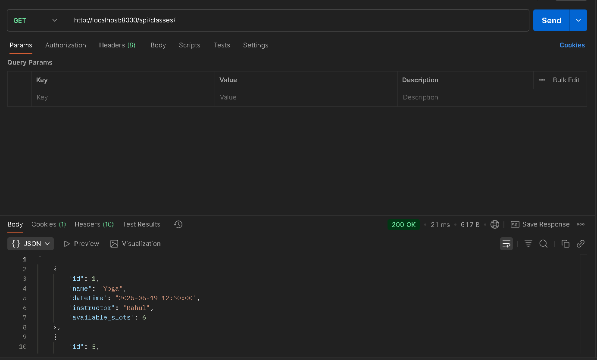
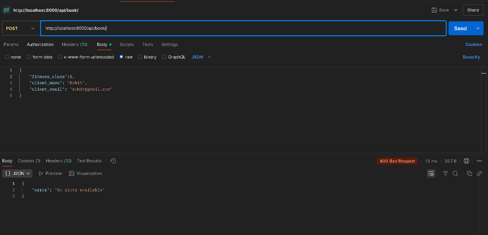
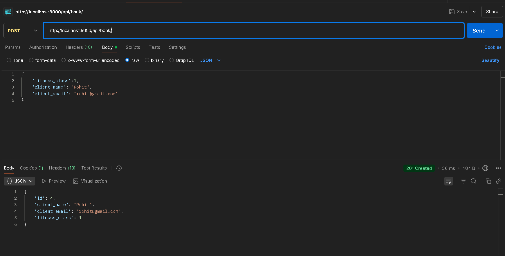
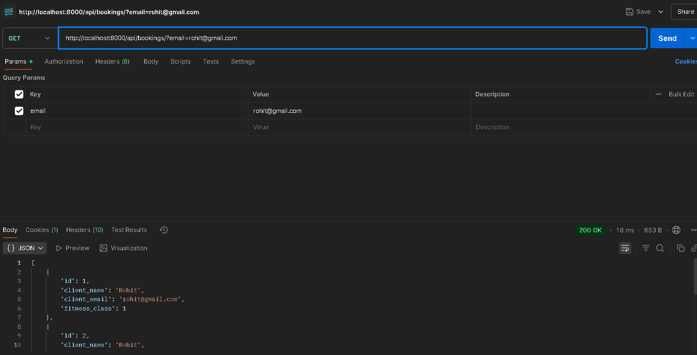

# Omnify Booking API

A simple backend API built using Django REST Framework for booking fitness classes like Yoga, Zumba and HIIT

# Tech Stack

- Python 3.x
- Django 5.x
- Django Rest Framework
- SQLite (default DB)

## How to run the Project

1. Clone this repository:

```bash
git clone https://github.com/rajakokate/omnify-booking-api.git
cd omnify-booking-api
```

2. Create a virtual environment and activate it:

```bash
python -m venv venv
source venv/scripts/activate
```

3. Install all required packages:

pip install -r requirement.tx

4. Apply database migrations:

python manage.py migrate

5. Create a superuser to access the admin panel

python manage.py createsuperuser - username - email(optional) - password

6. Start the development server

python manage.py runserver

7. Visit http://localhost:8000/admin/ to log into the admin and create a few FitnessClass entries.
   Note -> At least one fitness class must be added before testing booking related APIs

---

### API Endpoints

1. View available Fitness Classes

GET /api/classes

- Returns all upcoming classes (Yoga, Zumba, HIIT) with date, instructor and available slots.
  GET `http://localhost:8000/api/classes/` 

- Optional Query Param:
  ?tz=UTC (or any valid timezones like Asia/Dubai)
  -> It conveerts the class timings from IST to the requested timezone
  GET `http://localhost:8000/api/classes/?tz=UTC` [/api/classes/?tz=UTC](./images/classesTZ.png)

2. Book a class

POST /api/book

- Use this endpoint to book a slot for a class

POST `http://localhost:8000/api/book/` 

- You must pass:
  "fitness_class":1, (class ID)
  "client_name": "Rohit",
  "client_email": "rohit@gmail.com"
- if a class has available slots, the booking will be created and the slot count will decrease by 1. (Check in django admin panel or /classes API)

Example request JSON

{
"fitness_class":1,
"client_name": "Rohit",
"client_email": "rohit@gmail.com"
}

- If no slots are available, it will return: 
  {
  "error":"No slots available"
  }

3. Get Bookings for a Client:

GET /api/bookings/?email=<email>

GET http://localhost:8000/api/bookings/?email=rohit@example.com 

- Show all bookings made using a specific mail
- You must pass the email as a query parameter

⚠️ Note:
Before using the booking APIs, make sure you've created at least one Fitness Class from the Django admin panel (/admin/). You can log in there using the superuser credentials created with createsuperuser.

---

:

📐Sample Postman Requests

# 1. View Classes

GET http://localhost:8000/api/classes/ (By default time is IST)
or
GET http://localhost:8000/api/classes/?tz=UTC (specifically for user timezone)

# 2. Book a Class

POST http://localhost:8000/api/book/
Body (raw JSON):
{
"fitness_class": 1,
"client_name": "Rohit Kumar",
"client_email": "rohit@example.com"
}

# 3. Get Bookings

GET http://localhost:8000/api/bookings/?email=rohit@example.com
